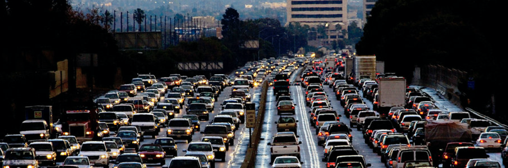

```{r setup, include=FALSE}
library(shiny)
library(shinydashboard)
library(leaflet)
library(leaflet.extras)
library(tidyverse)
library(tidyr)
library(class)
library(lubridate)
library(dplyr)
library(ggpubr)
library(gganimate)
library(shinythemes)
knitr::opts_chunk$set(echo = TRUE, comment = NA, 
                      message = FALSE, warning = FALSE)
```

```{r echo=FALSE, out.width='100%'}

```

### Main Objective
Chicago is the third biggest city in the United States. Seated by Michigan Lake and the Great Shoreline, Chicago attracts millions of tourists, both domestic and oversea. In 2016, 54.1 million out-of-towners visited Chicago, marked a new record for the Wind City. Together with the city’s huge span of over 10000 km^2 and 3 million population, Chicago city caters for the huge transportation needs through its one of the largest transportation system in the US. Among all transportation services, taxi serves as a role to offer fast and steady commute within city blocks.

In this project, our group tried to summarize the frequency of taxi rides in Chicago using the Chicago taxi data in 2016 by an R shiny app. We hope to figure out which features will increase the probability of a person to call for a taxi through visualization. Is it time, place, day or temperature? The original data was retrieved from Chicago Data Portal(https://data.cityofchicago.org/Transportation/Taxi-Trips/wrvz-psew) and was organized into an Rds file. There were 23 variables in our data frame, the major ones including:
Pickup and Drop-off location
Trip start and end time

Please run the `app.R` rscript file to see our Shiny app.


### Data
We have collected data from Chicago Data Portal written above through the API they provided. The original dataset is consist of several years' taxi trip which have pick up, drop off time and location variable with trip distance and their fare. We extract the data from 01-01-2016 to 12-31-2016 based on pick up time by database API query. In addition to reduce the size of data, we used data whose payment type is cash. The data is provided in three format; json, geojson, and csv and we choose the csv type. There were some observations or variables which included NAs, and we excluded them and executed complete analysis. To show trend association between air temperature and taxi usage, we also used weather dataset which Chicago Data Portal provide. 

```{r load data}
# read data
taxi <- readRDS("taxi.Rds")
landmark <- vroom::vroom("https://data.cityofchicago.org/resource/tdab-kixi.csv") %>% 
  mutate_each(function(x){ifelse(is.na(x),"Unknown",x)})

weather <- vroom::vroom("https://data.cityofchicago.org/resource/yw6r-xr7g.csv?$limit=1000000") %>% 
  select(measurement_timestamp, air_temperature) %>% 
  mutate(measurement_timestamp = str_remove_all(measurement_timestamp,"\\s.*")) %>% 
  group_by(measurement_timestamp) %>% 
  summarise(air_temperature = mean(air_temperature))
```


### Methods and Result
We managed to visualize our data into three tabs. The first tab highlights taxi’s drop-off location in both cluster map and heat map. By changing time stamps, users are able to see which areas in Chicago are the taxi drivers most likely to drop off passengers in different times of the year, month and day. Also, by clicking onto the blue pin on the map, users could see the taxi trip details of that drop-off point. Similarly, in the second tab, we provided a map of taxis’ drop-off location. But this map linked drop-off location to the nearest landmark. Users can choose different time, with an additional parameter “popularity of landmark”, from which they can see the number of taxi passengers each landmark attracts. By clicking onto the pin on the map, users could get the description of that landmark. In the third tab, we created two histograms and a time series plot. These graphs were intended to show the pattern of taxi services provided according to time change.

We used “leaflet” package to create cluster, heat and visitor map in the first two tabs. We used “ggpubr” and “gganimate” packages to create histograms and time series plot in tab three. Tidyverse, dplyr and tidyr are used in data cleaning process.

After visualizing, we can conclude that people call for taxi more frequently on Friday compared to other days of the week and generally more calls at night especially from 4-8pm. Also, as the air temperature gets very low or very high, the number of calls for taxi increased. Lastly, there were high demands for taxi near the most popular landmark or the center of Chicago.

### Reference
https://data.cityofchicago.org/Transportation/Taxi-Trips/wrvz-psew <br/>    
https://www.showmeshiny.com/paris-car-accidents/ <br/>    
https://saxon.stat.duke.edu:3838/sms185/news_2/